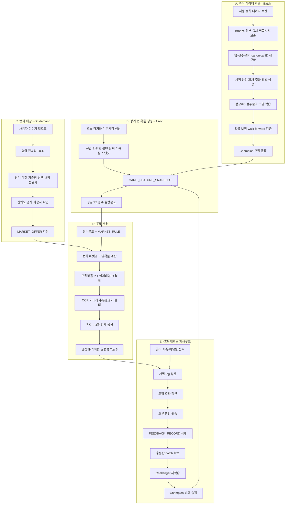

# MLB 확률·배당 조합 추천 파이프라인 초안

> 상태: **교차검증용 Draft**  
> 아직 프로젝트의 확정 파이프라인 문서로 반영하지 않았다.

## 1. 전체 흐름



## 2. 과거 데이터 학습 파이프라인

| 단계 | 입력 | 처리 | 출력 | 품질 게이트 |
|---|---|---|---|---|
| A1 수집 | 허용 출처 | 파일·스키마·출처 검증 | 원본 데이터 | 출처 정책 통과 |
| A2 Bronze | 원본 | 수정 없이 보존, 해시·취득시각 기록 | 원본 manifest | 중복·변조 없음 |
| A3 Silver | 경기·선수 원자료 | canonical ID, 타입·단위 통일 | 정규화 경기 사실 | 미연결 ID 기준 이하 |
| A4 Gold | Silver | 경기 이전 정보만 롤링 계산 | 피처·점수 라벨 | 미래 정보 누수 0건 |
| A5 학습 | 피처·점수 라벨 | 정규/F5 점수분포 학습 | Challenger | 학습 재현 가능 |
| A6 검증 | 미래 구간 | 확률·분포·마켓별 검증 | 평가 리포트 | 기준 모델보다 개선 |
| A7 등록 | 검증 통과 모델 | 버전·manifest 고정 | Champion | 승격 gate 통과 |

핵심 출력은 단일 승패가 아니라 다음 두 분포다.

```text
P(away_runs=x, home_runs=y | pregame features)
P(away_f5_runs=x, home_f5_runs=y | pregame features)
```

## 3. 경기 전 확률 생성

권장 기준시각 예시:

| 기준시각 | 주요 반영 정보 |
|---|---|
| T-24h | 예상 선발, 기본전력, 일정, 구장 |
| T-6h | 불펜 가용성, 최신 날씨, 이동·휴식 |
| T-90m | 예상 라인업, 결장 가능성 |
| T-30m | 확정 선발·라인업·날씨 |

각 실행은 기존 예측을 덮어쓰지 않고 새 `PREDICTION_RUN`으로 저장한다.

필수 lineage:

```text
event_id
as_of_timestamp
feature_snapshot_id
feature_version
model_version
data_coverage
uncertainty
```

## 4. 캡처 배당 처리

```text
이미지
-> 마켓 영역 분리
-> 텍스트·숫자·좌표·confidence 추출
-> event_id와 MARKET_RULE 매칭
-> 사용자 확인
-> MARKET_OFFER 확정
```

자동 제외 조건:

- 경기 식별 실패
- 기준점 또는 필수 배당 누락
- 미등록 정산 규칙
- 낮은 OCR 신뢰도
- 경기 시작 이후 캡처
- 사용자 미확인 후보

## 5. 마켓별 확률 변환

공통 입력은 점수 결합분포지만, 마켓마다 서로 다른 정산 조건을 적용한다.

```text
MoneylineRule
WinOneLossRule
HandicapRule
TotalRule
OddEvenRule
FirstFiveMoneylineRule
FirstFiveHandicapRule
FirstFiveTotalRule
```

각 규칙은 가능한 점수 셀을 다음 상태로 분류한다.

```text
WIN
LOSS
PUSH
HALF_WIN
HALF_LOSS
VOID
```

예시:

```text
U/O 7.5 UNDER:
  WIN  if away_runs + home_runs < 7.5
  LOSS if away_runs + home_runs > 7.5

Handicap +2.0:
  WIN  if selected_runs + 2 > opponent_runs
  PUSH if selected_runs + 2 = opponent_runs
  LOSS if selected_runs + 2 < opponent_runs
```

push가 없는 이진 마켓:

```text
EV = P(WIN) * decimal_odds - 1
```

push가 있는 마켓:

```text
EV = P(WIN) * (decimal_odds - 1) - P(LOSS)
```

quarter handicap은 split stake와 HALF_WIN/HALF_LOSS를 포함한 전체 payoff 기댓값으로
계산해야 한다.

## 6. 추천 후보와 조합 생성

개별 후보 계산:

```text
break_even_probability = 1 / decimal_odds
model_edge = model_probability - break_even_probability
individual_ev = expected payoff under the market settlement rule
```

후보 품질 게이트:

- 사용자 확인
- 모델 데이터 커버리지
- 확률 불확실성
- 마켓 규칙 등록 여부
- 최소 edge
- risk-adjusted EV

조합 규칙:

- 한 조합에 동일 경기 최대 1개
- 제외 후보 사용 금지
- 실제 캡처 배당만 곱함
- 모델 확률만 결합함
- 2·3·4폴을 별도 생성
- 추천 엔진 버전과 후보 집합을 기록

두 경기 예시는 경기 A 18개, 경기 B 11개 선택지로 유효 2폴 198개를 생성한다.

## 7. Top 5 출력

| 리더보드 | 기준 |
|---|---|
| 안정형 | 조합 생존확률 |
| 가치형 | 조합 EV |
| 균형형 | 확률 불확실성 하한을 적용한 risk-adjusted EV |

기본 화면은 균형형 Top 5 카드다. 카드마다 다음을 표시한다.

- 두 leg와 마켓 기준점
- 각 leg 모델확률과 실제 배당
- 조합 생존확률
- 합산배당
- EV와 risk-adjusted EV
- OCR 확인 상태
- 데이터 커버리지
- 모델·규칙·추천 엔진 버전

기준 통과 조합이 5개보다 적으면 실제 개수만 추천한다.

## 8. 결과 정산과 오류 귀속

공식 결과가 확정되면 개별 leg를 먼저 정산한 뒤 조합을 정산한다.

2폴에서 하나가 맞고 하나가 틀린 경우:

| 단위 | 저장 결과 | 학습 용도 |
|---|---|---|
| 적중 leg | `actual_label=1` | 해당 확률·점수분포의 적중 증거 |
| 실패 leg | `actual_label=0` | 실패 확률·분포와 원인 피처 분석 |
| 조합 | `won_legs=1`, `lost_legs=1` | 추천 정책·포트폴리오 평가 |

오류 분류:

1. OCR·경기 매핑 오류
2. 기준시각 데이터 누락
3. 선발·라인업 변경
4. 정산 규칙 불일치
5. 점수 평균 예측 오류
6. 점수 분산·상관 예측 오류
7. 확률 보정 오류
8. 정상적인 경기 변동성
9. 데이터 드리프트

## 9. 재학습과 승격

```text
공식 결과 누적
-> training_eligible feedback 선별
-> 일정 표본 batch 생성
-> Challenger 학습
-> 기존 Champion과 같은 미래 구간에서 비교
-> 개선 통과 시에만 승격
```

최소 평가 항목:

- Brier score
- log loss
- calibration error
- 점수분포 NLL/CRPS
- 마켓별 성능 slice
- ROI와 신뢰구간
- 최대 손실폭
- 데이터 누수 검사

## 10. 구현 경계 함수 초안

```text
ingest_sources()
normalize_entities()
build_point_in_time_snapshots()
build_feature_snapshot()
train_score_distribution()
calibrate_and_evaluate()
register_champion()
extract_market_offers()
derive_market_probabilities()
build_candidates()
generate_combinations()
rank_top_five()
settle_legs()
attribute_errors()
build_feedback_batch()
train_and_promote_challenger()
```

## 11. 권장 구현 순서

1. 데이터 계약과 canonical ID
2. 사업자별 `MARKET_RULE`
3. 시점 안전 원천·피처 파이프라인
4. 정규경기 점수분포 baseline
5. 캡처 후보 구조와 OCR 개선
6. 마켓확률 변환기
7. 후보·조합·Top 5
8. F5 모델과 전반 마켓
9. 결과 정산
10. feedback·challenger 승격

