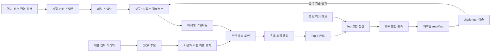
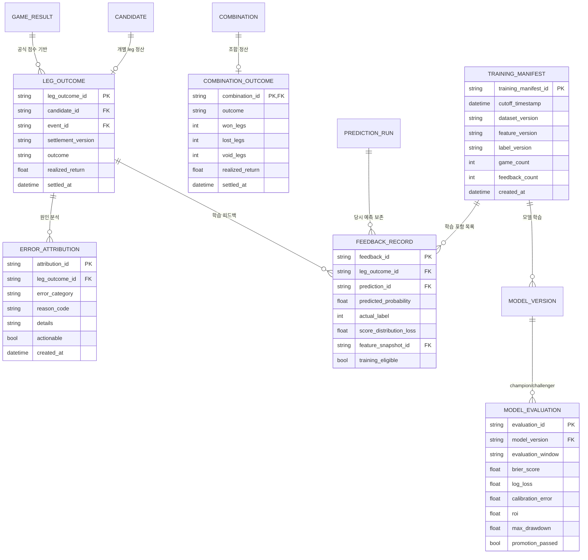

# MLB Decision Model 데이터 ERD

> 상태: **목표 논리 모델 v2.0**  
> 기준일: 2026-08-27  
> 이 문서는 데이터 구조의 단일 기준(source of truth)이다. 실제 저장 형식은 현재
> CSV/JSONL이지만, 파일·테이블·API를 구현할 때 아래 엔티티와 키를 유지한다.

## 1. 먼저 고정하는 데이터 경계

```text
야구 데이터 -> 모델 확률분포
사용자 캡처 -> 실제 마켓·기준점·배당
모델 확률 + 캡처 배당 -> 후보·조합·Top 5
공식 결과 -> leg별 정산·오류 귀속 -> 검증된 재학습
```

- 모델 데이터는 배당을 생성하지 않는다.
- 캡처 배당은 모델 확률을 대신하지 않는다.
- 과거 배당은 EV/ROI 검증에는 사용하지만, 기본 확률 모델의 입력에서는 분리한다.
- 조합 실패를 구성 leg 전체의 실패로 학습하지 않는다. 각 leg와 실제 점수분포를
  별도로 정산한다.
- 모든 경기 전 데이터에는 `as_of_timestamp`가 있어야 한다.

## 2. 전체 생명주기



ERD는 가독성을 위해 하나의 논리 모델을 세 영역으로 나눠 표시한다.

1. 경기 사실과 시점 스냅샷
2. 확률·배당·추천
3. 결과 정산과 재학습

---

## 3. ERD A - 경기 사실과 시점 스냅샷

```mermaid
erDiagram
    TEAM ||--o{ GAME : "home_team_id"
    TEAM ||--o{ GAME : "away_team_id"
    VENUE ||--o{ GAME : "venue_id"

    GAME ||--o| GAME_RESULT : "확정 결과"
    GAME_RESULT ||--o{ INNING_SCORE : "이닝별 점수"

    GAME ||--o{ PITCHING_APPEARANCE : "투수 등판"
    GAME ||--o{ BATTING_APPEARANCE : "타자 기록"
    GAME ||--o{ FIELDING_APPEARANCE : "수비 기록"
    GAME ||--o{ PLAY_EVENT : "플레이 원자료"
    TEAM ||--o{ PITCHING_APPEARANCE : "team_id"
    TEAM ||--o{ BATTING_APPEARANCE : "team_id"
    TEAM ||--o{ FIELDING_APPEARANCE : "team_id"
    PLAYER ||--o{ PITCHING_APPEARANCE : "player_id"
    PLAYER ||--o{ BATTING_APPEARANCE : "player_id"
    PLAYER ||--o{ FIELDING_APPEARANCE : "player_id"

    GAME ||--o{ STARTER_SNAPSHOT : "경기 전 선발"
    GAME ||--o{ LINEUP_SNAPSHOT : "경기 전 라인업"
    LINEUP_SNAPSHOT ||--|{ LINEUP_ENTRY : "1-9번 및 벤치"
    TEAM ||--o{ STARTER_SNAPSHOT : "team_id"
    TEAM ||--o{ LINEUP_SNAPSHOT : "team_id"
    PLAYER ||--o{ STARTER_SNAPSHOT : "starter_id"
    PLAYER ||--o{ LINEUP_ENTRY : "player_id"

    GAME ||--o{ PLAYER_AVAILABILITY : "부상·결장"
    TEAM ||--o{ PLAYER_AVAILABILITY : "team_id"
    PLAYER ||--o{ PLAYER_AVAILABILITY : "player_id"
    GAME ||--o{ WEATHER_SNAPSHOT : "기상 시점값"

    TEAM ||--o{ TEAM_STRENGTH_SNAPSHOT : "장기 기본전력"
    GAME ||--o{ TEAM_MATCHUP_FEATURE : "팀 상대전적"
    TEAM ||--o{ TEAM_MATCHUP_FEATURE : "home_team_id"
    TEAM ||--o{ TEAM_MATCHUP_FEATURE : "away_team_id"
    GAME ||--o{ PLAYER_MATCHUP_FEATURE : "BvP"
    PLAYER ||--o{ PLAYER_MATCHUP_FEATURE : "batter_id"
    PLAYER ||--o{ PLAYER_MATCHUP_FEATURE : "pitcher_id"
    GAME ||--o{ GAME_FEATURE_SNAPSHOT : "학습·예측 피처"

    TEAM {
        string team_id PK
        string canonical_name
        string league
        string active_from
        string active_to
    }
    PLAYER {
        string player_id PK
        string canonical_name
        string bats
        string throws
    }
    VENUE {
        string venue_id PK
        string venue_name
        string timezone
        float park_factor
    }
    GAME {
        string event_id PK
        datetime scheduled_at
        string season
        string home_team_id FK
        string away_team_id FK
        string venue_id FK
        string status
    }
    GAME_RESULT {
        string event_id PK,FK
        int home_runs
        int away_runs
        int home_f5_runs
        int away_f5_runs
        datetime confirmed_at
        string result_source
    }
    INNING_SCORE {
        string event_id FK
        int inning
        string batting_side
        int runs
    }
    PITCHING_APPEARANCE {
        string event_id FK
        string player_id FK
        string team_id FK
        int sequence
        int outs
        int earned_runs
        int strikeouts
        int walks
        int pitch_count
    }
    BATTING_APPEARANCE {
        string event_id FK
        string player_id FK
        string team_id FK
        int batting_order
        int plate_appearances
        int hits
        int home_runs
    }
    FIELDING_APPEARANCE {
        string event_id FK
        string player_id FK
        string team_id FK
        string position
        int errors
    }
    PLAY_EVENT {
        string play_id PK
        string event_id FK
        string batter_id FK
        string pitcher_id FK
        int inning
        string event_type
        int runs_scored
    }
    STARTER_SNAPSHOT {
        string snapshot_id PK
        string event_id FK
        string team_id FK
        string starter_id FK
        datetime as_of_timestamp
        bool confirmed
    }
    LINEUP_SNAPSHOT {
        string lineup_snapshot_id PK
        string event_id FK
        string team_id FK
        datetime as_of_timestamp
        bool confirmed
    }
    LINEUP_ENTRY {
        string lineup_snapshot_id FK
        string player_id FK
        int batting_order
        string position
        string lineup_status
    }
    PLAYER_AVAILABILITY {
        string availability_id PK
        string event_id FK
        string team_id FK
        string player_id FK
        datetime as_of_timestamp
        string availability_status
        string reason_code
    }
    WEATHER_SNAPSHOT {
        string weather_snapshot_id PK
        string event_id FK
        datetime as_of_timestamp
        float temperature_c
        float wind_speed
        float humidity
        float precipitation_prob
    }
    TEAM_STRENGTH_SNAPSHOT {
        string strength_id PK
        string team_id FK
        datetime as_of_timestamp
        float elo_rating
        float offense_strength
        float defense_strength
        string feature_version
    }
    TEAM_MATCHUP_FEATURE {
        string team_matchup_id PK
        string event_id FK
        string home_team_id FK
        string away_team_id FK
        datetime as_of_timestamp
        float h2h_shrunk_edge
        float recency_weight
        int effective_sample_size
        string feature_version
    }
    PLAYER_MATCHUP_FEATURE {
        string player_matchup_id PK
        string event_id FK
        string batter_id FK
        string pitcher_id FK
        datetime as_of_timestamp
        float bvp_shrunk_edge
        int plate_appearances
        string feature_version
    }
    GAME_FEATURE_SNAPSHOT {
        string feature_snapshot_id PK
        string event_id FK
        datetime as_of_timestamp
        string feature_version
        float starter_edge
        float bullpen_edge
        float lineup_edge
        float team_matchup_edge
        float bvp_edge
        float availability_edge
        float defense_edge
        float weather_edge
        float rest_edge
    }
```



### 팀 기본전력, 상대팀 전적, BvP의 차이

| 구분 | 단위 | 의미 | 처리 원칙 |
|---|---|---|---|
| `TEAM_STRENGTH_SNAPSHOT` | 팀 단독 | 특정 상대와 무관한 시점별 장기 공격·수비 전력 | Elo/state-space로 안정적 사전값 생성 |
| `TEAM_MATCHUP_FEATURE` | 팀 A vs 팀 B | 기본전력으로 설명되지 않는 반복 매치업 잔차 | 최근성·홈/원정·선발·라인업·구장 조건 후 Bayesian shrinkage |
| `PLAYER_MATCHUP_FEATURE` | 타자 vs 투수 | 개인 단위 상대전적(BvP) | 타석 수에 따라 강하게 축소 보정 |

상대팀 전적은 팀 기본전력 안에 숨기지 않는다. 다만 과거 상대전적의 원시 승률을
그대로 사용하면 로스터 변화와 소표본에 과적합되므로, 조건부 잔차만 작은 가중치로
사용한다.

---

## 4. ERD B - 확률, 캡처 배당, 추천 조합

```mermaid
erDiagram
    GAME_FEATURE_SNAPSHOT ||--o{ PREDICTION_RUN : "예측 입력"
    MODEL_VERSION ||--o{ PREDICTION_RUN : "실행 모델"
    PREDICTION_RUN ||--|{ SCORE_PROBABILITY : "점수 결합분포"
    PREDICTION_RUN ||--o{ MARKET_PROBABILITY : "파생 마켓확률"
    MARKET_RULE ||--o{ MARKET_PROBABILITY : "정산 사건 정의"

    CAPTURE_SESSION ||--|{ MARKET_OFFER : "OCR·확인 배당"
    GAME ||--o{ MARKET_OFFER : "event_id"
    MARKET_RULE ||--o{ MARKET_OFFER : "market_rule_id"

    RECOMMENDATION_RUN ||--o{ CANDIDATE : "확률+배당 조인"
    MARKET_PROBABILITY ||--o{ CANDIDATE : "모델 P"
    MARKET_OFFER ||--o{ CANDIDATE : "실제 O"
    RECOMMENDATION_RUN ||--o{ COMBINATION : "유효 조합"
    COMBINATION ||--|{ COMBINATION_LEG : "2-4 legs"
    CANDIDATE ||--o{ COMBINATION_LEG : "선택 후보"

    MODEL_VERSION {
        string model_version PK
        string model_family
        string target_segment
        string training_manifest_id FK
        datetime trained_at
        string status
    }
    PREDICTION_RUN {
        string prediction_id PK
        string event_id FK
        string feature_snapshot_id FK
        string model_version FK
        datetime as_of_timestamp
        float coverage
        string prediction_status
    }
    SCORE_PROBABILITY {
        string prediction_id FK
        string segment
        int away_runs
        int home_runs
        float probability
    }
    MARKET_RULE {
        string market_rule_id PK
        string provider
        string segment
        string market_type
        string settlement_version
        bool includes_extra_innings
    }
    MARKET_PROBABILITY {
        string market_probability_id PK
        string prediction_id FK
        string market_rule_id FK
        float line_value
        string selection_key
        float model_probability
        float uncertainty
    }
    CAPTURE_SESSION {
        string capture_id PK
        datetime captured_at
        string image_hash
        string ocr_version
        string verification_status
    }
    MARKET_OFFER {
        string offer_id PK
        string capture_id FK
        string event_id FK
        string market_rule_id FK
        float line_value
        string selection_key
        float decimal_odds
        float ocr_confidence
        bool user_verified
    }
    RECOMMENDATION_RUN {
        string recommendation_run_id PK
        datetime created_at
        string strategy
        int legs
        int requested_top_n
        string engine_version
    }
    CANDIDATE {
        string candidate_id PK
        string recommendation_run_id FK
        string market_probability_id FK
        string offer_id FK
        float break_even_probability
        float model_edge
        float individual_ev
        bool eligible
        string exclusion_reason
    }
    COMBINATION {
        string combination_id PK
        string recommendation_run_id FK
        int rank
        int leg_count
        float hit_probability
        float combined_odds
        float expected_return
        float risk_adjusted_ev
        string recommendation_status
    }
    COMBINATION_LEG {
        string combination_id FK
        string candidate_id FK
        int leg_index
    }
```



### 결합 계산의 데이터 출처

| 계산값 | 데이터 출처 |
|---|---|
| `model_probability` | `SCORE_PROBABILITY`에서 `MARKET_RULE`에 맞는 셀을 합산 |
| `decimal_odds` | 사용자가 확인한 `MARKET_OFFER` |
| `break_even_probability` | `1 / decimal_odds` |
| `model_edge` | `model_probability - break_even_probability` |
| `individual_ev` | `model_probability * decimal_odds - 1` |
| 조합 생존확률 | 서로 다른 경기 leg의 모델확률 결합 |
| 조합 배당 | 실제 캡처 배당의 곱 |
| 조합 EV | `hit_probability * combined_odds - 1` |

`CANDIDATE`는 확률과 배당이 처음 만나는 지점이다. 모델 학습 테이블에는
`decimal_odds`가 자동으로 섞이지 않는다.

---

## 5. ERD C - 결과 정산, 오류 귀속, 재학습



### 2폴에서 하나만 틀렸을 때

| 저장 단위 | 결과 | 학습 사용 |
|---|---:|---|
| Leg A | `actual_label=1` | 해당 마켓확률과 점수분포에 적중 증거로 반영 |
| Leg B | `actual_label=0` | 실패 leg의 확률·분포 오차와 원인 피처를 반영 |
| 조합 | `won_legs=1`, `lost_legs=1`, 조합 실패 | 추천 정책·포트폴리오 성과 평가에 사용 |

조합 실패를 이유로 Leg A까지 `0`으로 학습하면 라벨이 오염된다. 재학습의 기본 단위는
개별 leg와 실제 점수분포이고, 조합 결과는 추천 정책 평가용이다.

### 오류 원인 코드

| `error_category` | 예시 |
|---|---|
| `INPUT_ERROR` | OCR 배당·기준점·팀·마켓 매핑 오류 |
| `POINT_IN_TIME_MISSING` | 선발 변경, 라인업, 부상, 날씨가 기준시각에 없음 |
| `MODEL_ERROR` | 득점 평균·분산·상관 또는 확률 보정 오류 |
| `SETTLEMENT_RULE_ERROR` | 연장, push, 승1패 `1`, F5 종료 규칙 불일치 |
| `NORMAL_VARIANCE` | 확률은 보정됐지만 낮은 확률 결과가 정상 발생 |
| `DATA_DRIFT` | 팀 전력, 환경, 리그 규칙의 분포 변화 |

한 경기마다 즉시 운영 모델을 업데이트하지 않는다. 공식 결과가 확정되고 충분한
`FEEDBACK_RECORD`가 쌓이면 새 `TRAINING_MANIFEST`로 challenger를 학습한다.
`MODEL_EVALUATION.promotion_passed=true`일 때만 champion을 교체한다.

---

## 6. 현재 코드에서 목표 엔티티로의 매핑

| 현재 데이터/코드 | 목표 엔티티 | 상태 |
|---|---|---|
| Retrosheet `gameinfo.csv` | `GAME`, `GAME_RESULT` | ETL 일부 구현 |
| `pitching.csv` | `PITCHING_APPEARANCE` | ERA 롤링 일부 구현 |
| `batting.csv` | `BATTING_APPEARANCE` | 원천 읽기 가능, 피처 미구현 |
| `fielding.csv`, `teamstats.csv` | `FIELDING_APPEARANCE`, 라인업·수비 피처 | 미구현 |
| `plays.csv` | `PLAY_EVENT`, `PLAYER_MATCHUP_FEATURE` | 미구현 |
| `TRAINING_ROW` CSV | `GAME_FEATURE_SNAPSHOT` | 9개 edge 중 일부만 구현 |
| `model.json` | `MODEL_VERSION` artifact | 학습 코드만 있고 실제 artifact 없음 |
| `snapshot.py` JSONL | `CAPTURE_SESSION`, `MARKET_OFFER` | 단일 선택 중심으로 구현 |
| `decision.py` | `CANDIDATE`, `COMBINATION`, `COMBINATION_LEG` | 조합 계산 구현, 후보 풀 확장 필요 |
| 없음 | `SCORE_PROBABILITY`, `MARKET_PROBABILITY` | 신규 필요 |
| 없음 | `LEG_OUTCOME`, `ERROR_ATTRIBUTION`, `FEEDBACK_RECORD` | 신규 필요 |
| 없음 | `TRAINING_MANIFEST`, `MODEL_EVALUATION` | 신규 필요 |

## 7. 구현 순서

1. `TEAM`, `PLAYER`, `VENUE`, `GAME` canonical ID를 먼저 고정한다.
2. Retrosheet 원천을 경기 사실 엔티티로 정규화한다.
3. `as_of_timestamp` 기반 선발·라인업·가용성·날씨 스냅샷을 만든다.
4. 팀 기본전력, 상대팀 전적, BvP를 분리해 `GAME_FEATURE_SNAPSHOT`을 만든다.
5. 모델 버전과 정규/F5 `SCORE_PROBABILITY` 저장 계약을 만든다.
6. OCR 결과를 `CAPTURE_SESSION`과 다수의 `MARKET_OFFER`로 저장한다.
7. 확률과 배당을 `CANDIDATE`에서 결합하고 유효 조합과 Top 5를 생성한다.
8. 공식 결과로 leg를 정산하고 오류 원인을 기록한다.
9. batch feedback으로 challenger를 학습하고 검증 통과 시에만 승격한다.

## 8. 변경 규칙

- 새 데이터셋·피처·마켓을 추가하기 전에 이 문서의 엔티티와 관계부터 갱신한다.
- FK 없이 이름 문자열로 임시 조인하지 않는다.
- `as_of_timestamp`, `feature_version`, `model_version`, `settlement_version`을 생략하지 않는다.
- 모델 입력, 캡처 배당, 추천 출력, 공식 결과를 한 테이블에 혼합하지 않는다.
- README에는 전체 흐름과 문서 링크만 유지하고, 상세 필드 정의는 이 문서에서 관리한다.
